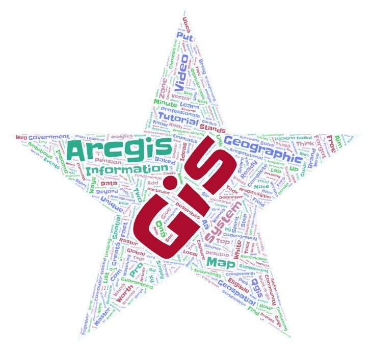
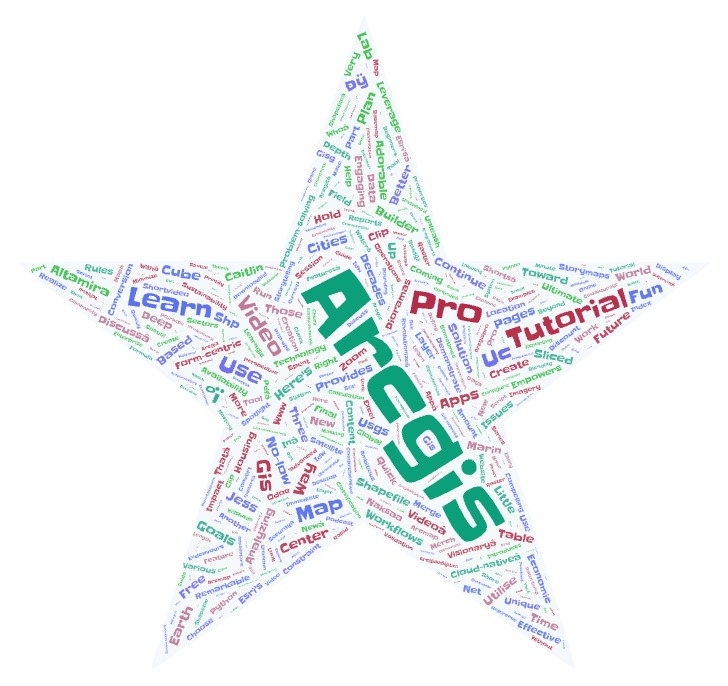
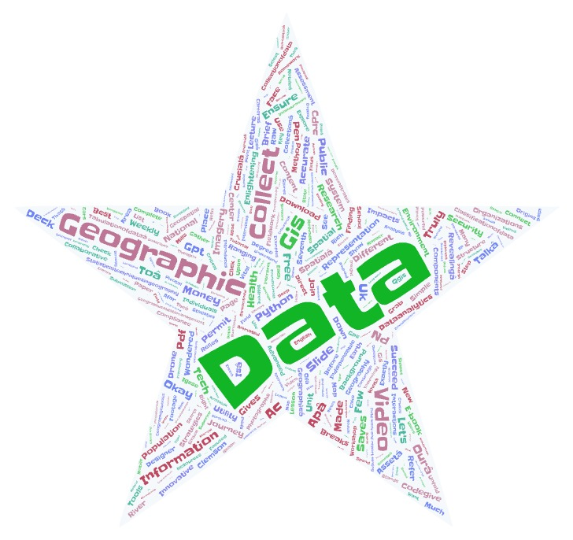
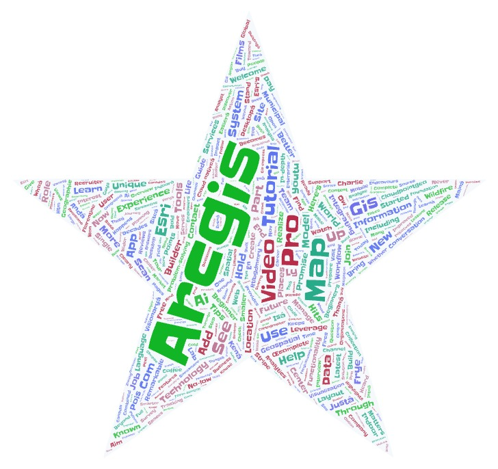

# AJs_Geog458_Lab2
Please create a narrative based on your research. In your narrative, please describe
1. the topic as well as the parameters you have used for search (5 PTS)
2. why do you want to make this comparison (5 PTS)
3. compare the word clouds and discuss the difference or similarity among the word clouds (5 PTS)
4. what might be the possible reasons for the patterns you observed (5 PTS)
5. how your research could be improved in the future (5 PTS)
6. anything you find from the map or data that is different from your expectation before the exercise, or anything that stands out to you (5 PTS)
7. Export the two or more word clouds to the repository and then insert them to the readme.md. (5 PTS)
8. The readme.md also needs to include a url to download the result spreadsheets (csv file) of the collected data (5 PTS).

My research:
1. I decided to do a deep dive into different keywords in Geography Data Science and see how each one was different or similar and try and make assumptions as to why. My four key phrases were GIS, ARCGIS, ESRI, and Geographic Information Systems and the Youtube crawler searched for all the words in the descriptions in the videos and organized them based on frequency in a word cloud.

2. I want to make this comparison because I want to see any prevailing words or ideas that show up withing these common areas of GIS.

3. The GIS wordcloud's biggest word is GIS followed by Arcgis, geographic, information, map, and system. The Arcgis wordcloud's biggest word was Arcgis followed by Pro, totorial, learn, use, map, and run. The Geographic information systems wordcloud's biggest word was Data followed by geographic, collect, GIS, information, and video. The ESRI wordcloud's biggest word is Arcgis followed by video, tutorial, pro, map, and GIS. They all hold very similar words like GIS, Arcgis, map, tutorial, and video. This is expected because I was simply comparing different popular parts of Geography data science. It was interesting to note how Arcgis and ESRI both leaned more into more educational videos as their wordcoulds have tutorial, learn, use, run, and video.

4. The reason for this is that Arcgis and esri are things you can use as a geographer rather than what you study. GIS and geographical information systems tend to just have more general stuff like arcgis, data, geographic, and map.

5. I think for a future expirement like this I would improve it be directly comparing all of these to things geography related that do not mention data or technology like maps, geography, and other different kinds of geography. I would then compare and contrast them and see how they compare.

6. The thing that stands out the most is how the ESRI serch has Arcgis as its most common word and ESRI is way smaller, which is weird because when searching on Youtube it usually tries to match the word you search closely but it seems ESRI and Arcgis are so closely related that it has the top spot.

### Word Cloud 1

### Word Cloud 2

### Word Cloud 3

### Word Cloud 4

- [Download search-result-1.csv](https://raw.githubusercontent.com/fredand04/AJs_Geog458_Lab2/main/assets/search-results-1.csv)
- [Download search-result-2.csv](https://raw.githubusercontent.com/fredand04/AJs_Geog458_Lab2/main/assets/search-results-2.csv)
- [Download search-result-3.csv](https://raw.githubusercontent.com/fredand04/AJs_Geog458_Lab2/main/assets/search-results-3.csv)
- [Download search-result-4.csv](https://raw.githubusercontent.com/fredand04/AJs_Geog458_Lab2/assets/search-results-4.csv)